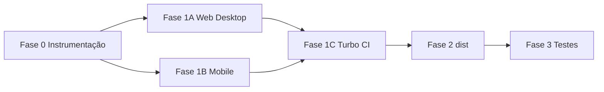

# Otimização de Bundle/Build/Startup (Decision-Complete)

Decisões e baseline já fechados conforme documento do usuário. Abaixo: mapeamento para o codebase atual e ordem de execução.

---

## Estado atual validado

| Item                                                                     | Situação                                                                                            |
| ------------------------------------------------------------------------ | --------------------------------------------------------------------------------------------------- |
| [apps/web/src-tauri/tauri.conf.json](apps/web/src-tauri/tauri.conf.json) | `frontendDist: "../dist"` — alinhar a `../dist/web` quando Vite outDir for `dist/web`               |
| [apps/web/src/routes/\_\_root.tsx](apps/web/src/routes/__root.tsx)       | Devtools importados estaticamente (linhas 3–5, 55–56) → mover para import dinâmico só em DEV        |
| [apps/web/vite.config.ts](apps/web/vite.config.ts)                       | Sem `build.outDir`, sem `manualChunks`                                                              |
| [apps/web/src-tauri/Cargo.toml](apps/web/src-tauri/Cargo.toml)           | Sem `[profile.release]`; sem `.cargo/config.toml` para target-dir                                   |
| [apps/web/package.json](apps/web/package.json)                           | `@prisma/client` e `@hookform/resolvers` presentes; **nenhum uso em apps/web/src** → remoção segura |
| [apps/native/metro.config.js](apps/native/metro.config.js)               | Sem `blockList`/exclusões para target, dist, .turbo, .git                                           |
| [apps/native](apps/native)                                               | 6 ficheiros importam `@expo/vector-icons` (root); sem jest.config.\* explícito                      |
| Raiz                                                                     | Sem `build:release`, `build:manifest`; [turbo.json](turbo.json) já com `outputs: ["dist/**"]`       |
| CI                                                                       | `.github/` inexistente → workflow novo                                                              |

---

## Fase 0 — Instrumentação + baseline reprodutível

- **Novos ficheiros (raiz ou `scripts/`):** `measure-build.mjs`, `collect-artifacts.mjs`, `generate-manifest.mjs`, `constants.mjs`; output gerado: `build-manifest.json`.
- **Alterar:** [package.json](package.json) (scripts de baseline/manifest), [README.md](README.md) (secção de medição e validação).
- **Schema do manifest:** commit, timestamp ISO, versões node/pnpm/cargo/rustc, OS, tempos por target, tamanhos de artefatos, resultado de testes/check-types.
- **Critério:** um comando único gera/atualiza `build-manifest.json` com schema estável.

---

## Fase 1A — Web/Desktop (Vite + Tauri + Rust)

- **[apps/web/src/routes/\_\_root.tsx](apps/web/src/routes/__root.tsx):** carregar React Query e Router devtools apenas em DEV via `import()` dinâmico; não importar em build de produção.
- **[apps/web/vite.config.ts](apps/web/vite.config.ts):** `build.outDir: "dist/web"`; `build.rollupOptions.output.manualChunks` conservador (ex.: `vendor` para react/router/query, outro para app).
- **[apps/web/package.json](apps/web/package.json):** remover `@prisma/client` e `@hookform/resolvers` (não usados em `apps/web/src`).
- **Rust release:** em [apps/web/src-tauri/Cargo.toml](apps/web/src-tauri/Cargo.toml) adicionar `[profile.release]` com `lto = "thin"`, `strip = "symbols"`, `panic = "abort"`, `codegen-units` balanceado.
- **Target Cargo:** criar `apps/web/src-tauri/.cargo/config.toml` com `build.target-dir` apontando para árvore em `dist/desktop/target` (path relativo ao crate: e.g. `../../../dist/desktop/target`).
- **[apps/web/src-tauri/tauri.conf.json](apps/web/src-tauri/tauri.conf.json):** `build.frontendDist` para `../dist/web` (consistente com outDir do Vite).
- **Critério:** bundle web em chunks; artefatos desktop gerados em árvore `dist/desktop/*`.

---

## Fase 1B — Mobile (Expo/Metro/EAS)

- **Novo:** [apps/native/eas.json](apps/native/eas.json) com perfis `development`, `preview`, `production`; scripts no [apps/native/package.json](apps/native/package.json) para EAS e export local para `dist/native/*`.
- **[apps/native/metro.config.js](apps/native/metro.config.js):** adicionar exclusões explícitas (ex.: `blockList` ou `watchFolders` excluindo) para `apps/web/src-tauri/target`, `dist`, `.turbo`, `.git`.
- **Ícones:** trocar imports de `@expo/vector-icons` (root) para módulos específicos (ex.: `@expo/vector-icons/Ionicons`, `@expo/vector-icons/MaterialIcons`) nos 6 ficheiros: `(drawer)/_layout.tsx`, `(drawer)/index.tsx`, `components/theme-toggle.tsx`, `modal.tsx`, `(drawer)/events/[eventId].tsx`, `(drawer)/(tabs)/_layout.tsx`.
- **Jest:** corrigir configuração Jest/TS/ESM em [apps/native](apps/native) (jest.config.\* ou package.json) para `pnpm --filter native run test` passar; manter cobertura executável.
- **Critério:** export mobile com outputs em `dist/native`; testes mobile a passar; redução mensurável do JS bundle.

---

## Fase 1C — Monorepo/Turbo/pnpm + CI

- **[package.json](package.json) (raiz):** adicionar `build:release`, `build:manifest`; scripts root já usam `turbo run ...` onde aplicável.
- **[turbo.json](turbo.json):** garantir que `build` (e tarefas de manifest) tenham `outputs` e dependências alinhadas com dist/.
- **Novo:** `.github/workflows/build-and-measure.yml` (ou nome acordado) com:
  - Cache: pnpm store, turbo cache, cargo (registry/git e target em `dist/desktop/target`).
  - Passos: install, build, test, check-types; geração e publicação de `build-manifest.json` como artifact.
- **Opcional:** [.npmrc](.npmrc) para determinismo se necessário; [.gitignore](.gitignore) para outputs residuais em `apps/*` se surgirem.
- **Critério:** `pnpm run build` e `pnpm run build:release` deixam `dist/` completo; CI reproduz comandos e gera manifest.

---

## Fase 2 — Padrão obrigatório dist/

- **Web:** `outDir` = `dist/web` (já definido em 1A).
- **Server:** se existir build de server, `outDir` = `dist/server`.
- **Desktop:** Cargo `target-dir` = `dist/desktop/target`; bundles Tauri finais em `dist/desktop/artifacts` (via Tauri config se necessário).
- **Mobile:** export local → `dist/native/expo-export-android`, `dist/native/expo-export-ios`; EAS artifacts → `dist/native/artifacts`.
- Scripts de build: ao fim, limpar outputs residuais em `apps/*` quando inevitável pela ferramenta.
- **Critério:** nenhum artefato final de build permanece em `apps/*`/`packages/*`; `build-manifest.json` contém tempos e tamanhos por target.

---

## Fase 3 — Testes e anti-regressão (obrigatório)

- **Rust:** `cargo test` (unit + integration em [tests/api_integration.rs](apps/web/src-tauri/tests/api_integration.rs)); reforçar pairing renew/falha/retry, locks multi-device, idempotência por `request_id`.
- **Web:** contrato do [takeout-api.ts](apps/web/src/lib/takeout-api.ts); regressão de real-time em `use-takeout-ws`; smoke e2e (Vitest + Playwright) para dashboard/import/event detail.
- **Mobile:** Jest corrigido (1B); regressão fila offline (enqueue/retry/removal); 409 e lock de outro device.
- **Contrato:** snapshots de payloads críticos sem alterar shape da API.
- **Critérios:** zero mudança observável de comportamento; contratos HTTP preservados; testes críticos passam em Windows 11 e Linux Zorin; métricas em build-manifest.json; sem piora de performance em fluxos críticos.

---

## Ordem de execução recomendada

- Fase 0 primeiro (baseline e manifest).
- 1A e 1B em paralelo após 0; 1C após 1A+1B (depende de dist/ e scripts).
- Fase 2 consolida todos os outputs em dist/.
- Fase 3 garante anti-regressão e use cases críticos.

---

## Comandos de validação (Windows 11 / Linux Zorin)

- `pnpm install`
- `pnpm run build`
- `pnpm run build:release`
- `pnpm run check-types`
- `pnpm --filter native run test`
- (Rust) `cargo test` em `apps/web/src-tauri`

**Nota:** Corrigir `check-types` em web (falha atual em `input.tsx` linha 8) para gate de qualidade consistente; pode ser feito em Fase 0 ou 1A.
